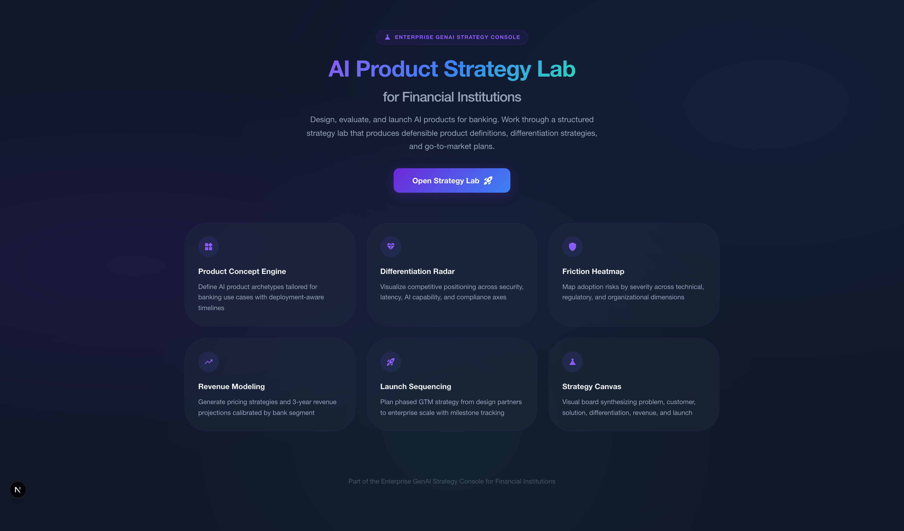
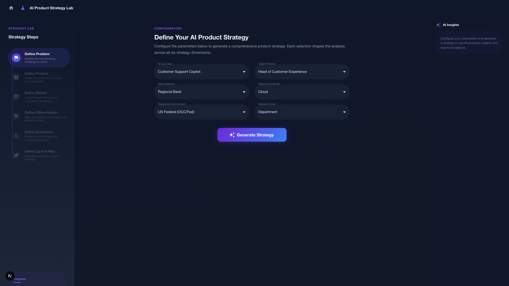
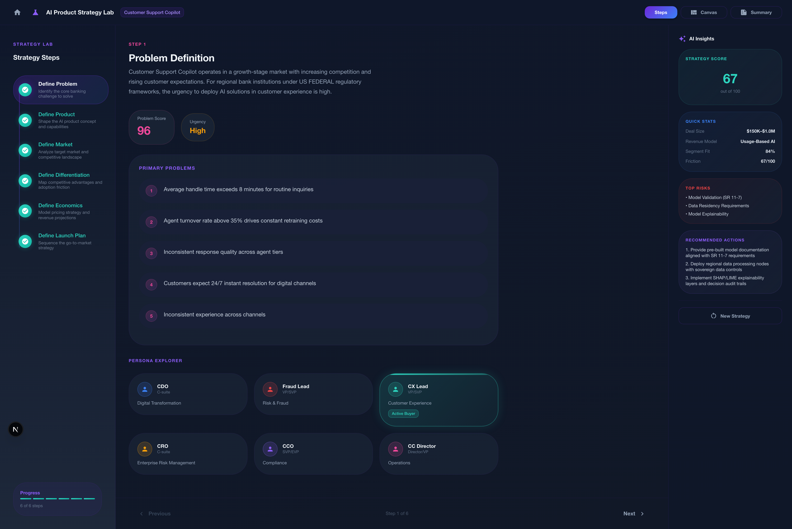
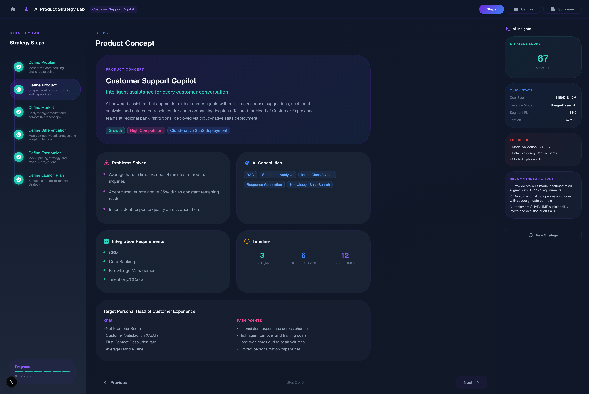
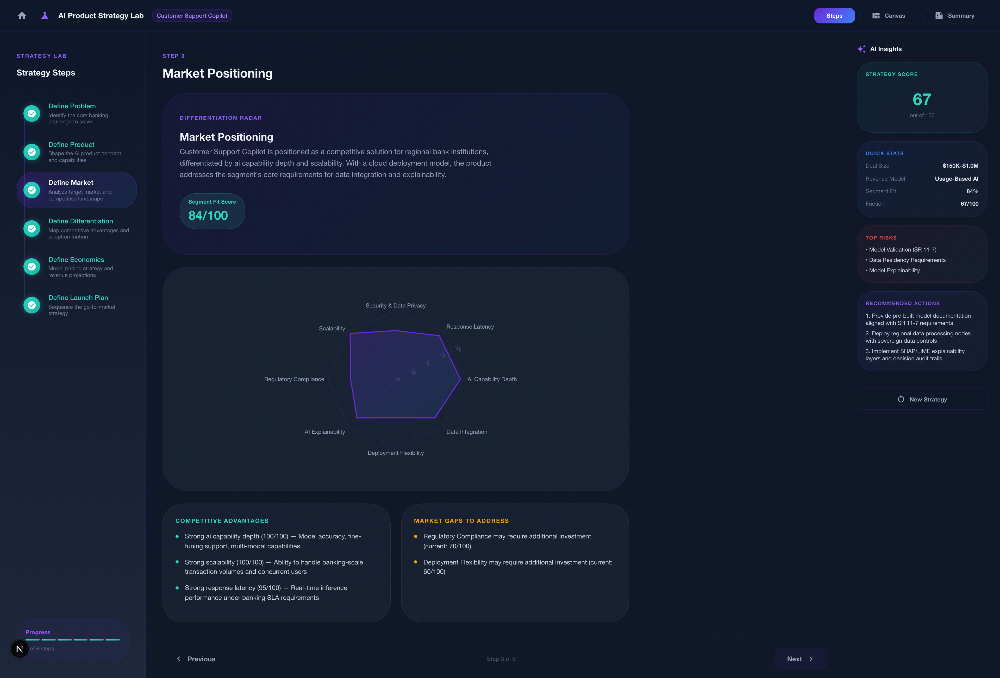
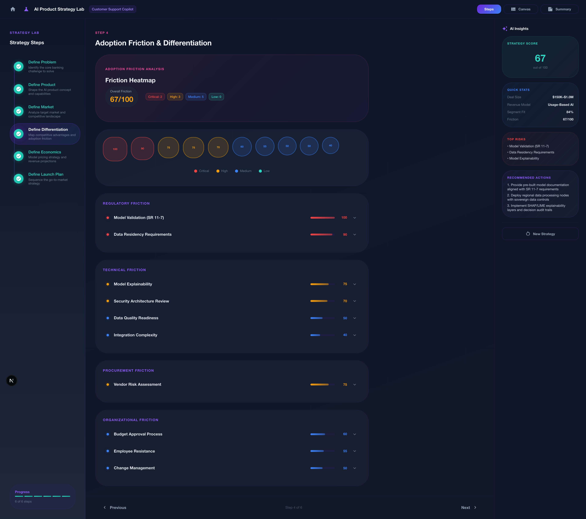
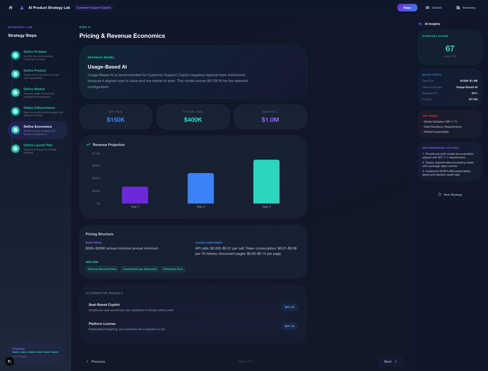
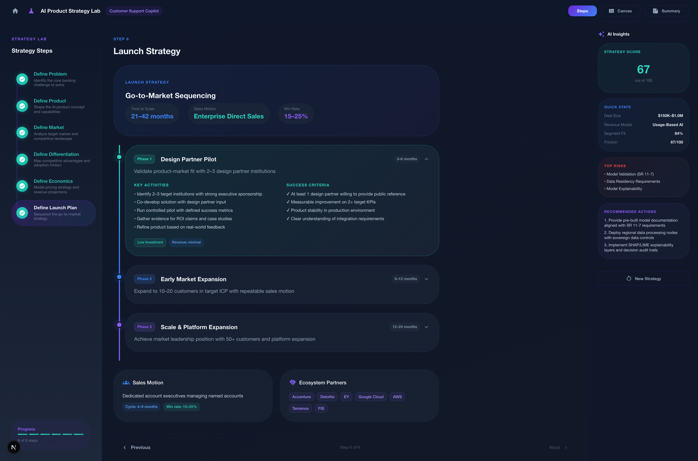
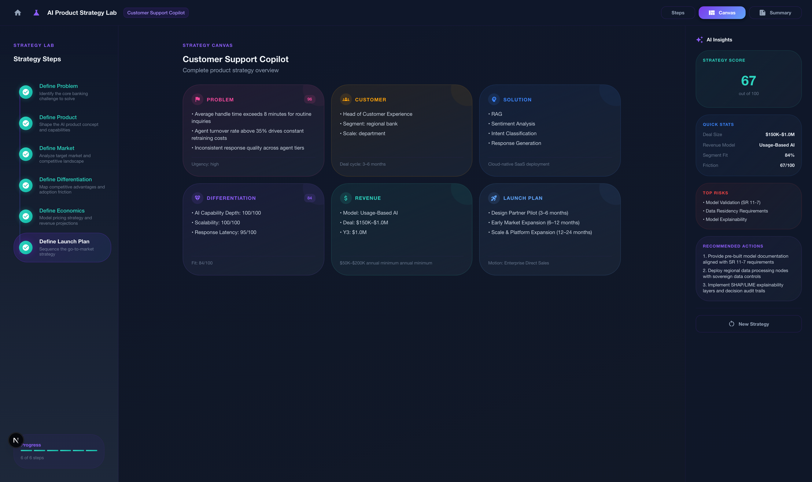
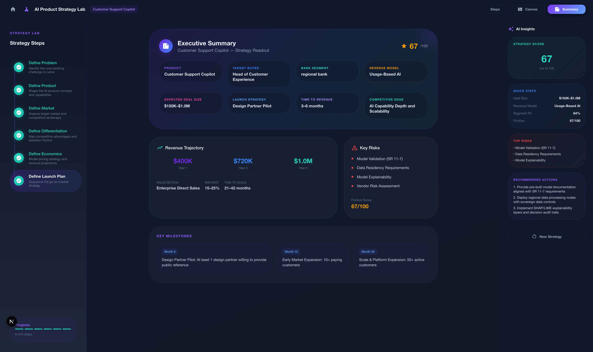

# AI Product Strategy Lab for Financial Institutions

> Design, evaluate, and launch AI products for banking. Work through a structured strategy lab that produces defensible product definitions, differentiation strategies, and go-to-market plans.

Part of the **Enterprise GenAI Strategy Console** — a comprehensive suite for enterprise AI adoption in financial services.

---

## Demo Video

https://github.com/user-attachments/assets/demo.mp4

> *Full walkthrough: Landing → Configuration → Problem Definition → Product Concept → Market Positioning → Friction Analysis → Pricing → Launch Timeline → Strategy Canvas → Executive Summary*

---

## Screenshots

### Landing Page


### Configuration Panel — Codelabs-Style Layout


### Step 1: Problem Definition


### Step 2: Product Concept


### Step 3: Market Positioning & Differentiation Radar


### Step 4: Adoption Friction Heatmap


### Step 5: Pricing & Revenue Economics


### Step 6: Launch Timeline


### Strategy Canvas


### Executive Summary


---

## What This Tool Does

This is **not a marketing generator**. It is a product strategy engine that simulates how an enterprise team would design, evaluate, and launch an AI product in banking.

The tool produces:

- **Product Definition** — AI product archetypes with capabilities, integration requirements, and deployment-aware timelines
- **Differentiation Strategy** — Interactive radar chart mapping competitive positioning across 8 axes
- **Adoption Friction Analysis** — Severity-based heatmap of technical, regulatory, organizational, and procurement risks
- **Pricing & Revenue Models** — Segment-calibrated pricing recommendations with 3-year revenue projections
- **Launch Sequencing** — Phased GTM strategy from design partners to enterprise scale
- **Executive Summary** — Composite scoring and milestone-driven readout

---

## Design Philosophy

Inspired by:

- **Google Codelabs** — Step-based progressive exploration
- **Google AI Studio** — Immersive workspace panels
- **NotebookLM** — Research card interaction patterns
- **Material 3 Expressive** — Dark theme with soft glow effects

### Layout

Three-panel Codelabs-style layout:

| Left Panel | Center Panel | Right Panel |
|---|---|---|
| Strategy Steps Navigator | Interactive Workspace | AI Insights & Recommendations |

### Theme

| Element | Color |
|---|---|
| Primary | Midnight Blue `#0F172A` |
| Accent 1 | Vivid Purple `#6D28D9` |
| Accent 2 | Neon Blue `#3B82F6` |
| Highlight 1 | Teal `#2DD4BF` |
| Highlight 2 | Magenta `#EC4899` |
| Background | Dark gradient `#0F172A → #111827` |

---

## Strategy Workflow

Users work through 6 structured strategy steps:

```
Define Problem → Define Product → Define Market → Define Differentiation → Define Economics → Define Launch Plan
```

### Input Parameters

| Parameter | Options |
|---|---|
| AI Use Case | Customer Support Copilot, Fraud Investigation Assistant, AI Underwriting Advisor, Compliance Intelligence Engine, Personal Financial Advisor AI, Transaction Insights AI |
| Target Persona | Chief Digital Officer, Head of Fraud, Head of CX, Chief Risk Officer, Head of Compliance, Contact Center Director |
| Bank Segment | Tier-1 Bank, Regional Bank, Digital Bank, Credit Union |
| Deployment Model | Cloud, Hybrid, Private Cloud |
| Regulatory Environment | US Federal (OCC/Fed), EU DORA, UK FCA, APAC MAS |
| Adoption Scale | Pilot, Department, Enterprise, Multi-Entity |

### Three Views

1. **Steps View** — Step-by-step walkthrough with progressive reveal
2. **Strategy Canvas** — 6-section visual board (Problem, Customer, Solution, Differentiation, Revenue, Launch)
3. **Executive Summary** — Final readout with composite scoring and key milestones

---

## Architecture

```
src/
├── app/
│   ├── layout.tsx
│   ├── globals.css
│   ├── page.tsx                            # Landing page
│   └── ai-product-strategy-lab/page.tsx    # Strategy lab (main tool)
├── components/strategy/
│   ├── StrategyNavigator.tsx               # Left panel step navigation
│   ├── StrategyWorkspace.tsx               # Center workspace router
│   ├── ProductConceptCard.tsx              # Product definition cards
│   ├── PersonaExplorer.tsx                 # Hover-to-reveal persona insights
│   ├── DifferentiationRadar.tsx            # Recharts radar chart
│   ├── FrictionHeatmap.tsx                 # Severity heatmap visualization
│   ├── PricingPanel.tsx                    # Revenue model + bar chart
│   ├── LaunchTimeline.tsx                  # Phased launch timeline
│   ├── StrategyCanvas.tsx                  # 6-section visual board
│   └── ExecutiveSummary.tsx                # Executive readout
├── data/
│   ├── banking_ai_products.json            # 6 product archetypes
│   ├── banking_personas.json               # 6 buyer personas
│   ├── banking_pricing_models.json         # 5 pricing structures
│   └── banking_gtm_framework.json          # Launch phases, sales motions, partners
├── lib/strategy/
│   ├── types.ts                            # TypeScript type system
│   ├── problemDefinitionEngine.ts          # Problem analysis engine
│   ├── productConceptEngine.ts             # Product concept generation
│   ├── marketPositioningEngine.ts          # Differentiation scoring
│   ├── pricingStrategyEngine.ts            # Pricing recommendation
│   └── launchSequencingEngine.ts           # Friction + launch phasing
└── theme.ts                                # MUI dark theme
```

### Engine Modules

| Module | Purpose |
|---|---|
| `problemDefinitionEngine` | Scores urgency based on segment, regulatory environment, and competitive intensity |
| `productConceptEngine` | Generates product concepts with deployment-adjusted timelines and capabilities |
| `marketPositioningEngine` | Calculates differentiation scores across 8 axes with segment-specific boosts |
| `pricingStrategyEngine` | Recommends pricing model, estimates deal sizes, projects 3-year revenue |
| `launchSequencingEngine` | Analyzes adoption friction factors and generates phased GTM strategy |

### Data Models

| Dataset | Records | Key Fields |
|---|---|---|
| Banking AI Products | 6 archetypes | Problem statements, value drivers, risk factors, AI capabilities |
| Banking Personas | 6 buyers | KPIs, pain points, buying triggers, adoption blockers |
| Pricing Models | 5 structures | Tier ranges, segment multipliers, advantages/risks |
| GTM Framework | 3 phases + motions | Activities, success criteria, ecosystem partners |

---

## Tech Stack

| Technology | Version | Purpose |
|---|---|---|
| Next.js | 16.1.6 | App Router framework |
| React | 19.2.3 | UI library |
| MUI | 7.3.8 | Component library (dark theme) |
| Framer Motion | 12.6.3 | Animations and transitions |
| Recharts | 3.7.0 | Radar chart and bar charts |
| TypeScript | 5.x | Type safety |
| Zod | 4.3.6 | Schema validation |

---

## Getting Started

### Prerequisites

- Node.js 18+
- npm or yarn

### Installation

```bash
git clone https://github.com/Phani3108/AI-Product-Strategy-Lab---Financial-Institutions.git
cd AI-Product-Strategy-Lab---Financial-Institutions
npm install
```

### Development

```bash
npm run dev
```

Open [http://localhost:3000](http://localhost:3000)

### Production Build

```bash
npm run build
npm start
```

---

## Enterprise GenAI Strategy Console

This tool is **Module 6** of the full console:

| # | Module | Purpose |
|---|---|---|
| 1 | Platform Decision Engine | Evaluate and compare AI platforms |
| 2 | Architecture Studio | Design AI solution architectures |
| 3 | Cost Intelligence | Simulate and optimize AI costs |
| 4 | Enterprise AI Adoption Analyzer | Assess organizational readiness |
| 5 | Scenario Studio | Compare deployment scenarios |
| 6 | **AI Product Strategy Lab** | Design and launch AI products |

Together, these modules cover the **full lifecycle of enterprise AI adoption** — from platform selection through architecture design, cost modeling, readiness assessment, scenario planning, and product strategy.

---

## License

MIT
